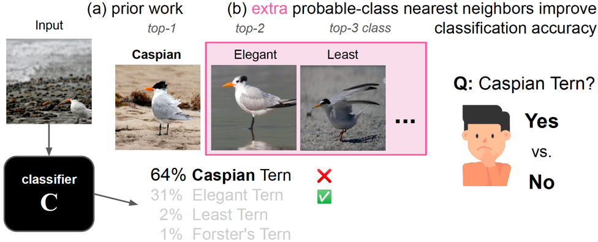
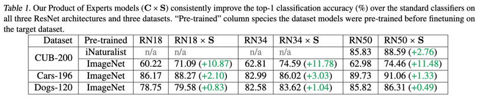
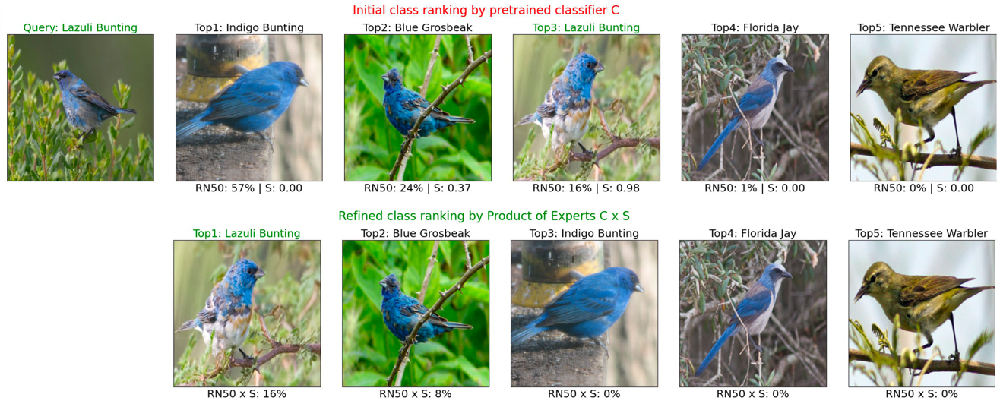
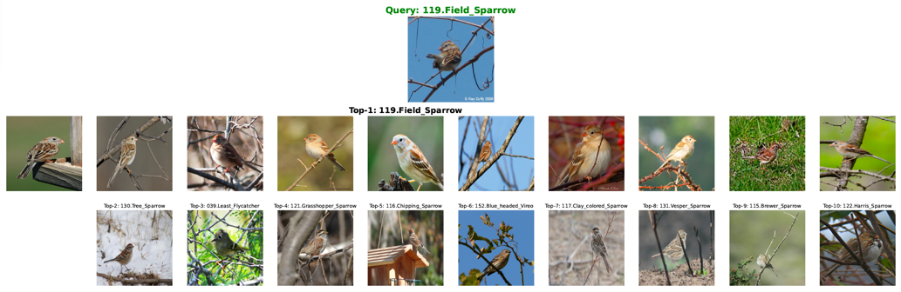
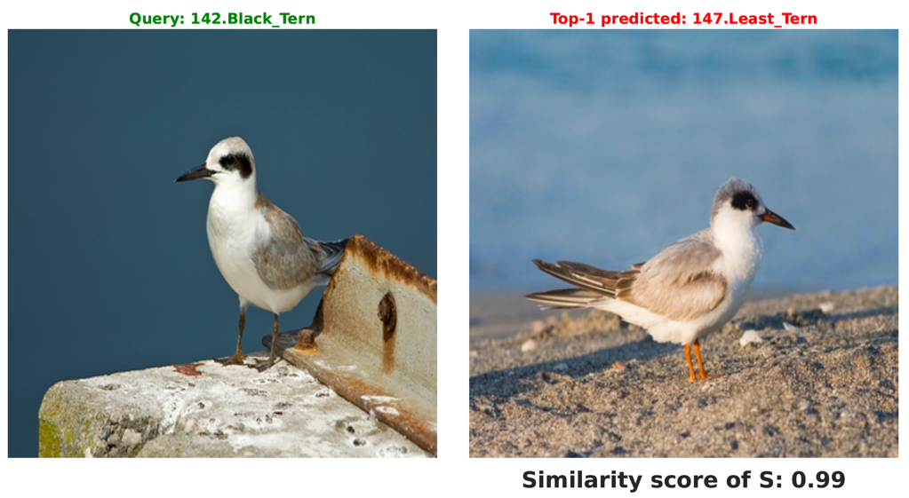
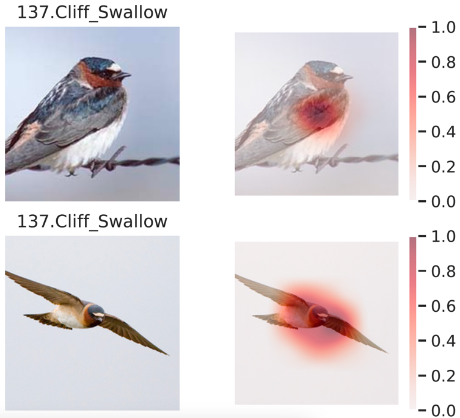

# PCNN: Probable-Class Nearest-Neighbor Explanations Improve Fine-Grained Image Classification Accuracy for AIs and Humans [.pdf](https://arxiv.org/pdf/2308.13651.pdf)



```markdown
Nearest neighbors are traditionally used to compute final decisions, e.g., in Support Vector Machines or 
-NN classifiers and to provide users with supporting evidence for the model's decision. In this paper, we show a novel use of nearest neighbors: To improve predictions of an existing pretrained classifier \classifier. We leverage an image comparator \comparator that (1) compares the input image with nearest-neighbor images from the top-
 most probable classes; and (2) weights the confidence scores of \classifier (like a Product of Experts). Our method consistently improves fine-grained image classification accuracy on CUB-200, Cars-196, and Dogs-120. Furthermore, a human study finds that showing layusers our probable-class nearest neighbors (PCNN) improves their decision-making accuracy over showing only the top-1 class examples (as in prior work).
```

## Training image-comparator networks

First, download pretrained models for CUB-200, Cars-196, and Dogs-120 at [this link](https://drive.google.com/drive/folders/1pC_5bEi5DryDZCaKb51dzCE984r8EnqW?usp=sharing).

**CUB-200**:

Step 1: Set `global_training_type = 'CUB'` and `self.set = 'train'` in `params.py`

Step 2:
> sh train_cub.sh


The same repeated for Cars-196 and Dogs-120 but set `global_training_type = 'CARS'` or `global_training_type = 'DOGS'` respectively.

## Testing (Binary classification and Reranking)

For CUB-200,

Step 1: Set `global_training_type = 'CUB'` and `self.set = 'test'` in `params.py`

Step 2:
> sh test_cub.sh

The same repeated for Cars-196 and Dogs-120 but set `global_training_type = 'CARS'` or `global_training_type = 'DOGS'` respectively to get the main table.



## Visualizing qualitative figures
For CUB-200,

Step 1: Set `global_training_type = 'CUB'` and `self.set = 'test'` in `params.py`

Step 2:

1. Corrections of S
> python cub_visualize_corrections.py



2. Training pairs of S
> cub_visualize_training_nns.py



3. Failures of S (please change `VISUALIZE_COMPARATOR_CORRECTNESS` in `params.py` to `True`)
> python cub_infer.py



3. Attentions of S (please change `VISUALIZE_COMPARATOR_HEATMAPS` in `params.py` to `True`)
> python cub_infer.py



Same steps repeated for Cars-196 and Dogs-120.


## Human study data

We share the samples that we used for CUB-200 and Cars-196 human studies at [this link](https://drive.google.com/drive/folders/1yNIOfypfy1vvI3Q3MAq9LNIVlyQ3WY-V?usp=sharing).
