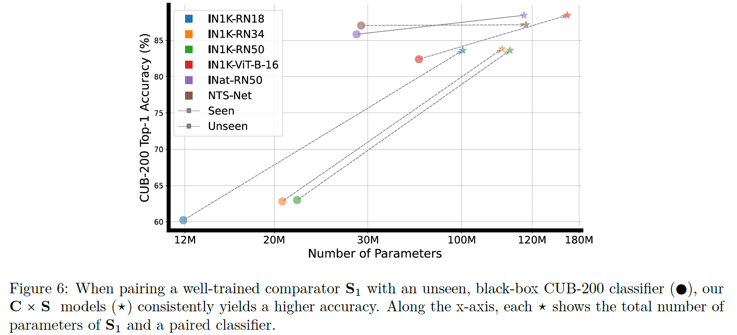

> 1. (Requested Changes 1) How does the proposed method perform on tasks other than fine-grained image classification, such as object detection or semantic segmentation (the paper is 47 pages long so hopefully I didn’t miss any results)?

> 2. (Requested Changes 2) Can the re-ranking algorithm be extended to handle multi-label classification problems?

Multi-label classification is a type of machine learning problem where each instance (or example) can 
be assigned multiple labels from a set of possible labels, rather than just one. 
This differs from the traditional single-label classification tasks, where each instance is 
associated with only one label.

See the above picture for an example of prediction in multi-label image classification. 
The ground-truth is a binary vectors indicating the presence of classes {y1, y2, ..., yℓ}, yi ∈ {0, 1}. {y1, y2, ..., yℓ}, yi ∈ {0, 1}.

Then, for each label, the two classes to be re-ranked here are the presence (1) and absence (0) of the object (i.e. umbrella).
To extend our re-ranking algorithm to handle multi-label classification problems, we compare the input image with the nearest neighbors from the two classes, presence and absence,
using the image comparator S.
Here, S gives us a similarity score in the range of [0, 1] indicating if the two images contain the same object or not.

Another problem to concern is the number of classes to be re-ranked. In our submission, we propose to re-rank the top-10 classes predicted by the base classifier C.
Yet, in multi-label classification, the re-ranking algorithm could only care about the classes that are suggested by the pretrained classifier (e.g. person and umbrella in the above Figure).

This could help reduce the False Positive rate in multi-label classification tasks, where the model predicts the presence of an object that is not in the image.

> 3. (Requested Changes 3) How does the performance of the PoE model scale with the number of classes or the size of the dataset?

This is a very interesting question!
First, when the reviewer refers to the performance, we suppose that he is talking about the test-time accuracy of the model.

We suppose that there are three main factors that can affect the performance of the PoE model:
a. The number of classes (mentioned by the reviewer)
b. The size of the dataset (mentioned by the reviewer)
c. The performance of the base classifier C because the PoE model is a combination of the base classifier C and the image comparator S.

When the number of classes increases (a), the performance of the PoE model will likely decrease.
This is because having more classes will make the image comparator S more likely sees visually similar objects from different classes (e.g. Tern species in Fig.2 look very similar),
making the re-ranking weights more uniform across the classes, and thus reducing the effect of the image comparator S on the final predictions.

When the size of the dataset increases (b), the performance of the PoE model will likely increase because the image comparator S will have more data to learn from and 
combat with variations. For example, in CUB-200 datasets, within a class, there are many variations in the appearance of the same bird ([males, females, and juveniles](https://www.allaboutbirds.org/guide/Painted_Bunting/)).
Having more data will help the comparator S more robust to these variations, thus improving the PoE model CxS.

Regarding (c), we found that when C is low-performing, adding S (via PoE) will be very useful.
However, when C is already high-performing, adding S will not help much.
These two mentioned cases are respective to ImageNet-pretrained ResNet18 and NTS-Net in Fig. 6.

> 4. (Requested Changes 4) What is the impact of using different distance metrics or similarity measures for finding nearest neighbours on the performance of the PoE model?

Thank you for the insightful question! We suppose the reviewer refers to the test-time accuracy of the PoE model when he mentions the performance.

We want to break down the answer into two parts:

a. Given the NNs being found, we tested using different functions to measure the similarity between the input image and the NNs for reranking (See Tab. 7 in page 19).

We found our comparator S works the best for the reranking algorithm.

b. Fixing the similarity function as S, we tested using different distance metrics to find the nearest neighbors for reranking.
Here we assess the PoE performance on cosine similarity and [DreamSim](https://dreamsim-nights.github.io/).
Compared to using L2 as reported in our paper, cosine similarity measure the global similarity between two images while DreamSim
is a human-aligned similarity measure.

| Distance function                              | CUB-200 PoE perf (%) | Dogs-120 PoE perf (%) |
|------------------------------------------------|----------------------|-----------------------|
| Random                                         | 87.95%               | 85.89%                |
| L2                                             | 88.59%               | 86.31%                |
| Cosine                                         | 88.33%               | 86.25%                |
| [DreamSim](https://dreamsim-nights.github.io/) | 88.38%               | 86.56%                |
| Random (top-5 of DreamSim)                     | 88.37%               | 86.34%                |

We first test on CUB-200 and we found that different measures to retrieve NNs have a small to no impact on the PoE model performance.
We suppose that because the number of samples per class is fairly small (30 images per class on average), then when doing retrieval with different distance metrics, 
the nearest neighbors are not very different.

Then, we move from CUB-200 to Dogs-120 that has more samples per class (100 images per class on average).
Interestingly, we also found that different distance metrics have a small to no impact on the PoE model performance (see the above Table).

Our second hypothesis is that the image comparator S is robust to changes in the nearest-neighbor images it receives.
This robustness is from the data augmentation technique ([TrivialAugment](https://arxiv.org/pdf/2103.10158)) we applied during training (See Sec. B7 in paper).
To test this hypothesis, we first retrieve NNs using DreamSim and then randomly pick one sample from the top-5 NNs to do reranking.
We found that the PoE model is robust to changes in the nearest-neighbor images it receives, that can explain why with different measures (L2, cosine, DreamSim) the PoE model performance is similar.

We also test using the random nearest neighbors (i.e. randomly picking one sample from each class for reranking). Yet, it drops the PoE model performance from 88.59 to 87.95 on CUB-200 and from 86.31 to 85.89 on Dogs-120, respectively.
This reiterates the importance of using similarity measures in finding nearest neighbors.

> 5. (Requested Changes 5) Are there any theoretical insights or principles that can guide the design and training of the image comparator S?

The task of the image comparator S is inspired by the [distinction task](https://arxiv.org/pdf/2112.03184) where we give human users two images 
and ask them to judge if the two images are of the same class or not.

To compare the two images, we are inspired by [Siamese neural networks](https://www.cs.cmu.edu/~rsalakhu/papers/oneshot1.pdf) where the feature extractor
is shared between two branches and the similarity function is learnable.
In the experiment in Tab. 7, we found that this architecture (shared feature extractor + 4-layer MLP for similarity function) works the best for PoE model.

In training of S, we are inspired by a long line of work in [contrastive learning](https://arxiv.org/pdf/2002.05709) that aims to learn discriminative feature representations via 
same-class samples and different-class samples.
Yet, simple sampling techniques is not optimal for training S in an experiment shown in Sec. B.3.
The negative samples were randomly picked from the non-groundtruth classes.
We innovate by proposing a sampling strategy that selects the negative samples based on the softmax similarity of a pretrained classifier 
(i.e. improving PoE acc from 86.55% → 88.59% on CUB-200). 

> 6. (Requested Changes 6) In section 4.3 you say “First, we test using cosine similarity in the pretrained feature space of a CUB-200 classifier” – why do you call CUB-200 a classifier? CUB-200 is mentioned 80+ across the paper.

Sorry for the confusion. We revised the writing and changed "CUB-200 classifier" to "classifier" in the paper to avoid any misunderstanding.

> 7. (Potential Changes 1) Explore techniques to reduce the computational overhead introduced by the re-ranking process, such as efficient nearest neighbour search or pruning strategies.

Thanks for bringing up this point! We agree that the re-ranking process can be computationally expensive, especially when the dataset is large.
The computational overhead comes from a) finding the nearest neighbors or b) querying the image comparator S for reranking weights.

We found that a) can be easily done by leveraging speedup options of faiss.
For example, we can reduce the dimensionality of embeddings vectors from 2048 to 1024 or 512 by using earlier layers of the ResNet-50 for feature extraction.
Also, as we are currently use CPU for faiss indexing (L137 in this [file](https://anonymous.4open.science/r/nearest-neighbor-XAI-FF2E/cub-200/cub_extract_feature_for_reranking.py)), using GPU by GpuIndexFlatL2 from faiss can provide significant speedups, especially for larger datasets.
Another option is to adjust the precision of computations (e.g., using floating-point 16 bits instead of 32 bits) which can increase speed at the cost of some accuracy.

For b), we can reduce the number of queries to the image comparator S by using a threshold on the reranking weights.
Currently, we are setting this to 10 as we always examine the top-10 most probable classes.
Yet, there always exists classes receiving < 1% by ResNet50 (see Fig. 5), which are likely never to be the top-1 after reranking.
Reducing the number of K can save a lot of computation at a minimal cost of accuracy.

> 8. (Potential Changes 2) Extend the human study to other datasets and domains to further evaluate the interpretability and usefulness of PCNN explanations.

We plan to repeat the human study on Dogs-120.

> 9. (Potential Changes 3) Provide a theoretical analysis or insights into the effectiveness of the proposed approach, potentially drawing connections to existing theories or principles in machine learning or cognitive science.

Please see our response in <Requested Changes 5>.

> 10. (Weaknesses 2)The method relies on the availability of a well-trained comparator S, which may not be feasible or practical in certain scenarios.
